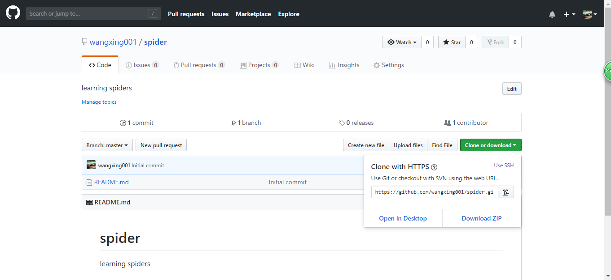

<h1 />git+github 使用方法总结

## 第一步

	下载gitbash

## 第二步

	安装完成，右单击显示如下

## 第三步 配置git

### 3.1 

	设置ssh key：
	打开git bash 输入：
	ssh-keygen -t rsa -C “注册github的邮箱”
	一直回车，选择默认路径和空密码，最后在默认路径下生成.ssh文件夹。
	以记事本的方式打开id_rsa.pub 整体复制秘钥

### 3.2 

**打开github，找到settings,点击ssh and GPG keys**

**选择new ssh key ,将复制的秘钥粘贴，点击add ssh key**

### 3.3 
	检查是否配置成功（提示是否continue，输入yes）

## 第四步 

	打开github，创建一个仓库（repository）
	有两种方式的链接（都可以用）：
	https
	ssh

## 第五步

	打开git bash，输入：
	git clone https/ssh

	之后出现这种错误，就再执行一次：ssh -T git@github.com
	
	在本地路径找到，则下载成功。

## 第六步 上传github

	打开git bash
	输入：
	1.	git init
	2.	git add “文件名”
	3.	git commit -m “提交说明”

> 注： 如果出现设置用户名和邮箱的提示，按照提示的格式输入即可，然后重新1,2,3步。

	4. git remote add origin https://github.com/wangxing001/spider

	出现fatal :remote origin already exists
	执行：git remote rm origin
		 git remote add origin https://...

	最后执行:git pull origin master
	git push -u origin master
	若弹出登录对话框，登录即可

	最后打开github项目查看即可。

	出现问题：Please make sure you have the correct access rights and the 	 repository exists。
	选择网址的时候，使用ssh方式，不用https方式

## 第七步 分支操作

### 7.1 创建本地分支

	查看分支 git branch 
	创建分支 git checkout -b 分支名称 

	创建一个view.py 进行测试
		vi view.py
		git add view.py
		git commit -m “说明信息”
		git push origin “分支名”

### 7.2 设置远程跟踪（本地跟踪服务器）

	git branch --set-upstream-to=origin/01-learn 01-learn            

### 7.3 合并分支
	git merge 分支名称

	如果这个两个分支间的修改没有冲突(conflict), 那么合并就完成了。如有有冲突，输入下	  面的命令就可以查看当前有哪些文件产生了冲突:
	$ git diff
	
	当你编辑了有冲突的文件，解决了冲突后就可以提交了。
	$ git commit -a
	提交(commit)了合并的内容后就可查看一下。
	
	执行了gitk后会有一个很漂亮的图形的显示项目的历史。
	$ gitk

	提交到github：
	git push origin master

	这样在github主分支上就合并了所有文件。

### 7.4 合并撤销

	如果你觉得你合并后的状态是一团乱麻，想把当前的修改都放弃，你可以用下面的命令回到合	并之前的状态：
	$ git reset --hard HEAD
	
	或者你已经把合并后的代码提交，但还是想把它们撒销：
	$ git reset --hard ORIG_HEAD

### 7.5 删除分支

	$ git branch -d experimental
	git branch -d 只能删除那些已经被当前分支的合并的分支. 
	如果你要强制删除某个分支的话就用 git branch –D；

### 7.6 删除本地仓库

- 删除文件：git rm filename
- 删除文件夹： git rm 文件夹名 -r -f
- 撤销修改：git checkout – filename
> (如果push了，先：git reset HEAD filename)
> 注：做了修改之后，先commit再push

### 7.7 拉取远程分支到本地

	git pull origin 01-learn
